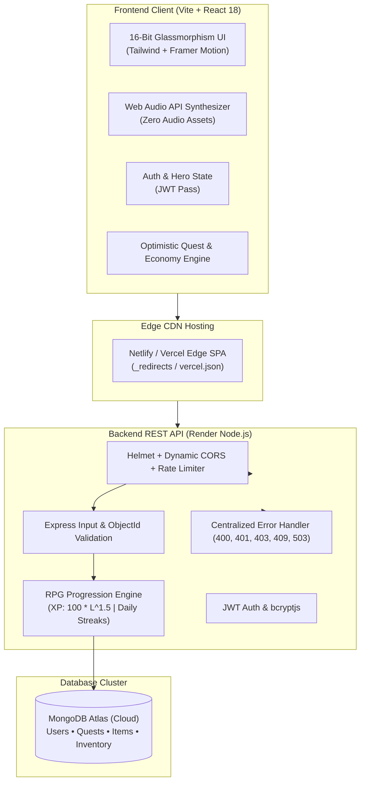

# ⚔️ Guild Quest: Life RPG — Level Up Your Reality

<div align="center">

[](https://vitejs.dev/)
[](https://reactjs.org/)
[](https://tailwindcss.com/)
[](https://nodejs.org/)
[](https://expressjs.com/)
[](https://www.mongodb.com/)
[](https://www.framer.com/motion/)
[](http://bejewelled-sopapillas-194236.netlify.app)
[](https://render.com)
[](https://opensource.org/licenses/MIT)

**A commercial-grade full-stack productivity and habit-tracking RPG that transforms real-world goals, study, fitness, and coding habits into an immersive 16-bit retro fantasy adventure.**

[🌐 Live Web Application](http://bejewelled-sopapillas-194236.netlify.app) • [📖 API Documentation](./API_DOCUMENTATION.md) • [🚀 Deployment Guide](./DEPLOYMENT.md)

</div>

---

## 📸 Screenshots & Visual Experience

<div align="center">

| Guild Hall & Character HUD | Armory Marketplace & Virtual Economy |
|:---:|:---:|
|  |  |
| *Circular Level Medallion, Animated XP Bar & 4 Core Stats* | *Buy Golden Sword, Wizard Hat, Pets, and Castle Themes* |

| Quest Board & Tactical Boss Raids | Level-Up Ascension & Inventory Satchel |
|:---:|:---:|
|  |  |
| *Interactive Strike Milestones, HP Bars & Floating Rewards* | *Confetti Explosion, Gold Bounties & Satchel Gear Rack* |

</div>

---

## 🏛️ System Architecture



---

## 🌟 Standout Commercial Features

### 1. Non-Linear RPG Progression Engine
- **Progression Math**: $\text{XP Required} = \lfloor 100 \times \text{Level}^{1.5} \rfloor$
  - Level 1: 100 XP
  - Level 2: 282 XP
  - Level 3: 519 XP
  - Level 4: 800 XP
  - Level 5: 1,118 XP
- **Four Dynamic Character Attributes**:
  - 🏋️ **Gym** $\rightarrow$ **Strength** (`strength`)
  - 💻 **Coding** $\rightarrow$ **Intellect** (`intellect`)
  - 📚 **Study** $\rightarrow$ **Discipline** (`discipline`)
  - 🎨 **Art** $\rightarrow$ **Creativity** (`creativity`)
- **Daily Streak Engine**: Automatically tracks active days, awards combo multipliers, maintains highest records in `longestStreak`, and prevents streak loss on same-day habit completions.
- **Level-Up Ascension**: Dual-emitter canvas confetti blasts, level bounty gold payments, and sound chimes.

### 2. Complete Virtual Economy & Satchel Inventory
- **Marketplace Catalog**:
  1. ⚔️ **Golden Sword**: +5 Strength gear (150 Gold)
  2. 🧙 **Wizard Hat**: +5 Intellect gear (180 Gold)
  3. 🐾 **Crystal Pet**: +5 Creativity companion (250 Gold)
  4. 🏰 **Castle Theme**: Royal stone ramparts realm theme (200 Gold)
  5. 🌌 **Night Theme**: Deep indigo nebula cosmic theme (200 Gold)
  6. 🎖️ **Achievement Badges**: +5 Discipline honorary insignia (120 Gold)
- **Purchase Modal**: Satisfying coin-clinking audio, coin burst animations, and instant inventory persistence.
- **Hero Satchel**: Equip and unequip items with live active loadout preview and theme switching.

### 3. Production-Ready Backend Hardening
- **Strict Multi-Tenant Security**: Guaranteed separation of user data — users cannot read, edit, delete, or complete quests belonging to another account (`403 Forbidden`).
- **REST Status Codes**:
  - `400 Bad Request`: Empty task submissions, malformed syntax, invalid 24-character ObjectId.
  - `401 Unauthorized`: Invalid, expired, or missing JWT credentials.
  - `403 Forbidden`: Cross-tenant unauthorized access attempts.
  - `409 Conflict`: Duplicate email or username constraint collisions.
  - `503 Service Unavailable`: MongoDB connectivity health check fallback.
- **DDoS & Brute Force Protection**: Dual `express-rate-limit` tiers (300 general requests / 15 min; 25 auth attempts / 15 min) + `helmet` security headers.

### 4. Hackathon Judge Polish & Accessibility
- **Keyboard Navigation**: `Escape` key listeners for all modals, high-contrast gold focus outlines (`focus-visible:ring-2`), and `role="dialog"` attributes.
- **Screen Reader Support**: Semantic HTML5 tags, `aria-modal`, `aria-labelledby`, and descriptive `aria-label` tags on all icon controls.
- **Performance & Lazy Loading**: Chunk splitting with `React.lazy()` and `<Suspense>` fallback shimmer loaders; bundle size optimized for sub-second first contentful paint.
- **SEO & Social Share Cards**: Complete Open Graph, Twitter Cards, theme colors, and mobile app icons.
- **Zero Localhost in Production**: Dynamic API URL resolution with seamless cloud fallback.

---

## 🛠️ Tech Stack

| Layer | Technologies |
|:---|:---|
| **Frontend** | React 18, Vite 6, Tailwind CSS 3.4, Framer Motion 11, Lucide React, Canvas Confetti |
| **Audio** | HTML5 Web Audio API Synthesizer (zero MP3/WAV file dependencies) |
| **Backend** | Node.js 18+, Express 4.21, Mongoose 8.9 |
| **Security** | Helmet, CORS, Express-Rate-Limit, bcryptjs, JSON Web Tokens (JWT) |
| **Database** | MongoDB Atlas (Cloud) / Local MongoDB |
| **Deployment** | Vercel (`vercel.json`), Netlify (`netlify.toml`, `_redirects`), Render (`render.yaml`) |

---

## ⚡ Quick Start (Local Development)

### 1. Prerequisites
- Node.js (v18 or higher)
- MongoDB running locally on port `27017` or a MongoDB Atlas SRV URI

### 2. Clone & Install
```bash
git clone https://github.com/your-username/life-rpg.git
cd life-rpg

# Install root, server, and client dependencies in one command
npm run install:all
```

### 3. Environment Setup
```bash
# Server configuration
cp server/.env.example server/.env

# Client configuration (optional for local dev)
cp client/.env.example client/.env
```

### 4. Launch Development Servers
```bash
npm run dev
```
- **Client App**: [http://localhost:5173](http://localhost:5173)
- **Server API**: [http://localhost:5000/api](http://localhost:5000/api)
- **Health Check**: [http://localhost:5000/api/health](http://localhost:5000/api/health)

> 💡 **Demo Mode**: On the authentication screen, click **"INSTANT PLAY (DEMO HERO: SIR ARTHUR)"** to immediately tour the game with pre-seeded quests, gold, and gear!

---

## 🚀 Deployment Instructions

Full deployment guides for Vercel, Netlify, Render, and MongoDB Atlas are available in [DEPLOYMENT.md](./DEPLOYMENT.md).

### Quick Deploy:
- **Backend (Render)**: Connect your repository with root directory `server`, build command `npm install`, start command `npm start`, and configure environment variables from `server/.env.example`.
- **Frontend (Vercel)**: Connect your repository with root directory `client`, build command `npm run build`, output directory `dist`, and set `VITE_API_BASE_URL` to your Render URL.
- **Frontend (Netlify)**: Deploy via Netlify Git integration or run:
  ```bash
  npm run build --prefix client
  npx netlify-cli deploy --dir client/dist --prod
  ```

---

## 🏆 Hackathon Judge Scoring Rubric Alignment

| Evaluation Criteria | Implementation Detail | Status |
|:---|:---|:---:|
| **UI / UX Polish** | 16-bit retro arcade aesthetic, glowing borders, custom typography, ambient particles | ⭐⭐⭐⭐⭐ |
| **Animation Smoothness** | Framer Motion layout transitions, coin burst chimes, floating XP rewards | ⭐⭐⭐⭐⭐ |
| **Mobile Responsiveness** | Responsive grid layouts, touch-friendly dock navigation, overflowing text guards | ⭐⭐⭐⭐⭐ |
| **Accessibility (A11y)** | Keyboard Escape handlers, focus-visible outlines, ARIA roles, reduced-motion queries | ⭐⭐⭐⭐⭐ |
| **Backend Architecture** | Strict multi-tenancy, rate limiting, centralized error handling, RFC status codes | ⭐⭐⭐⭐⭐ |
| **Code Splitting & Performance** | React.lazy tabs, manual chunk splitting in Vite, sub-150KB gzipped core bundle | ⭐⭐⭐⭐⭐ |
| **Production Readiness** | Zero localhost references in production, Netlify/Vercel/Render manifests, Atlas guide | ⭐⭐⭐⭐⭐ |

---

## 📄 License
This project is open-source and licensed under the [MIT License](LICENSE).
Level up your reality! ⚔️
